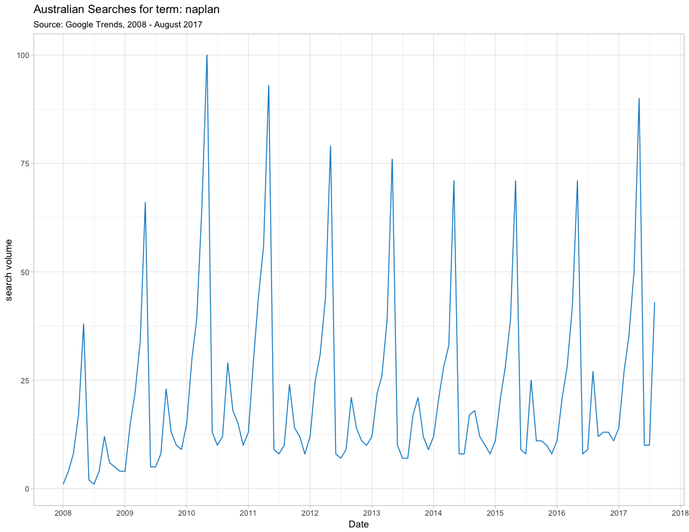
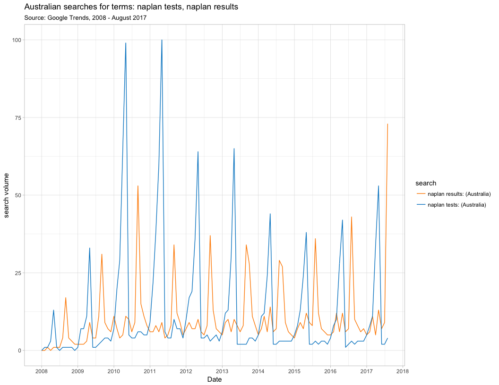

# NAPLAN in Google Trends
Neil Saunders  
compiled `r Sys.time()`  

# Introduction
Visualising Google Trends data for searches related to NAPLAN testing.

# Datasets
1. CSV file with the results of a basic search for the term "naplan"
1. CSV file with the results of a comparative search for the terms "naplan tests, naplan results"

# Visualisation
## Basic search
Observations:

1. We see 2 peaks per year, corresponding to testing and release of results
1. Interest was high in 2010-11, declined, then a recent rise - related to discussion of online tests?

<!-- -->

## Comparative search
Observations:

1. We see more clearly that the early peak corresponds to "tests", the later to "results"
1. In 2008: no peak for "results" inside the "tests" peak
1. In 2009: 1 peak for "results" inside the "tests" peak
1. From 2010: 2 peaks for results inside the "tests" peak, near the start and end of that peak

<!-- -->
